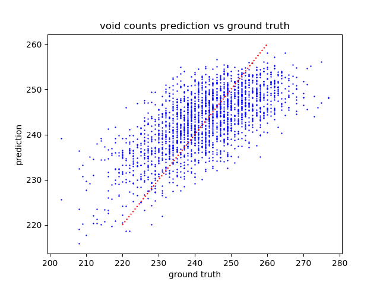
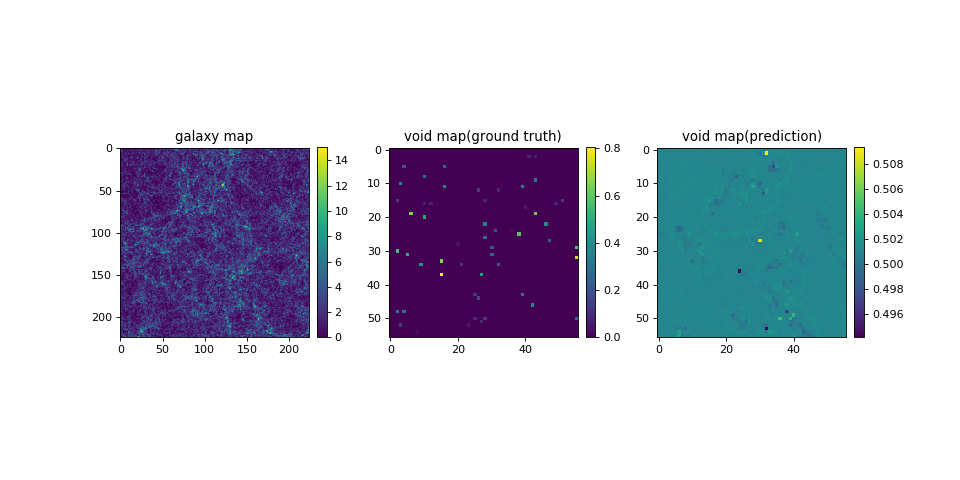
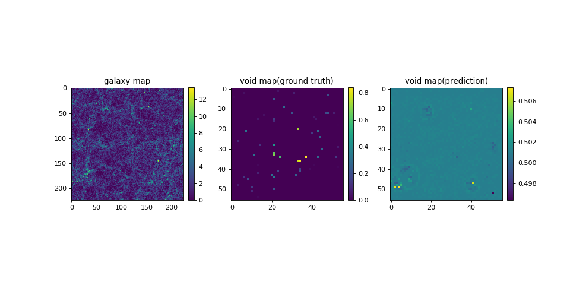
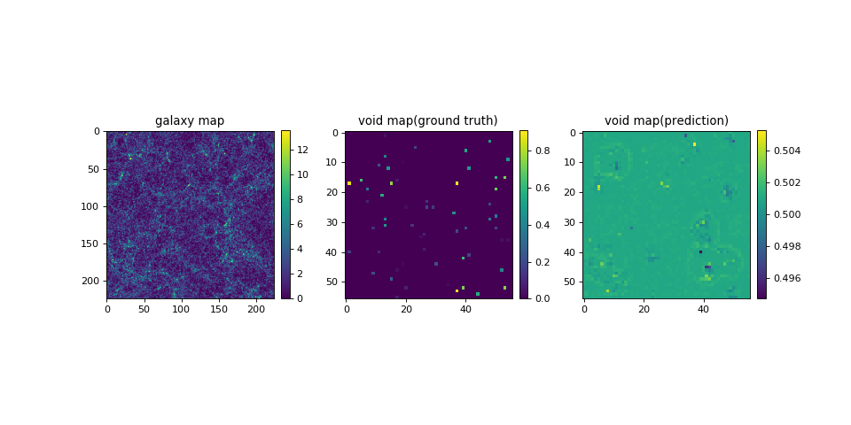
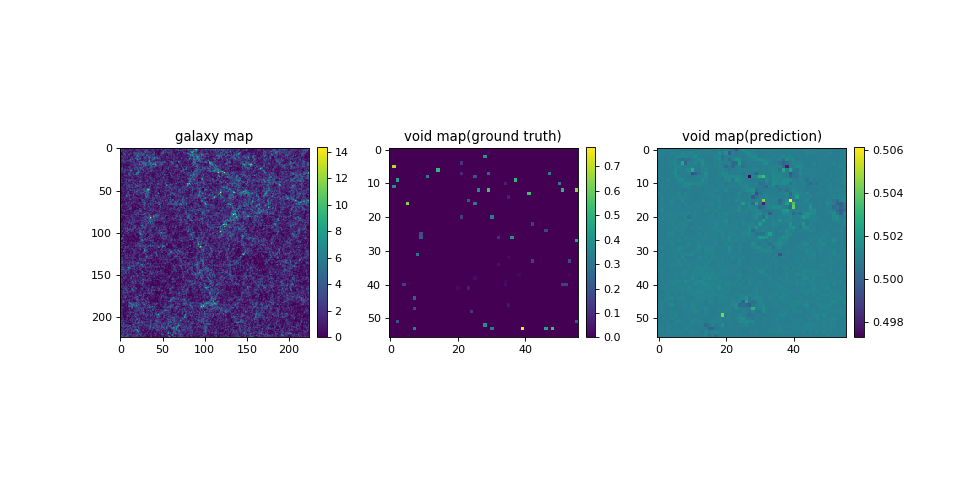
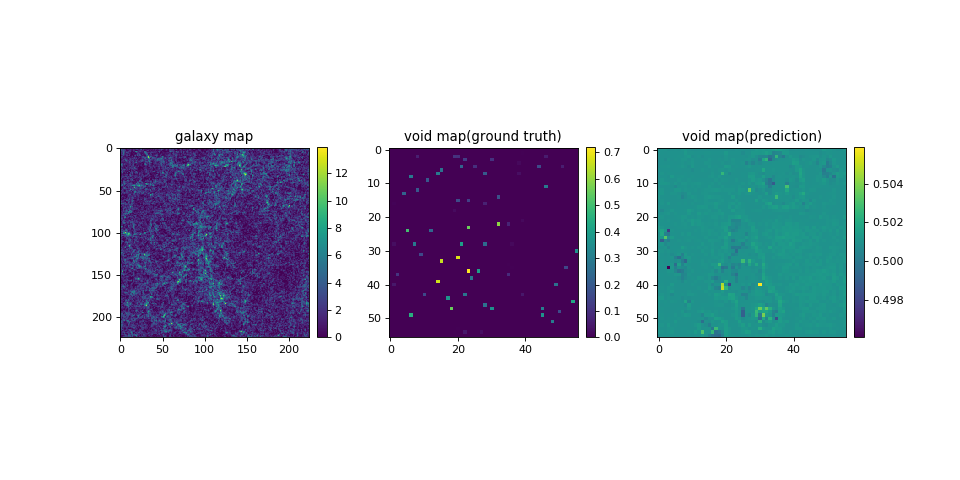
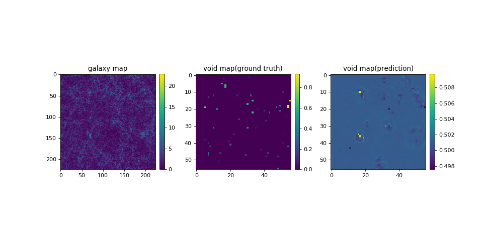

# Deep-Learning-Cosmic-Void-2019

This project uses **Convolutional Neural Network** to spot cosmic voids/dark matter from a given galaxy catalog!
It also constructs a pipeline for training Astrophysics datasets that can be used in many other cases with little modification.

Collaborator: [Joshua Yao-Yu Lin](https://github.com/joshualin24), PhD student in university of illinois urbana champaign
Data from: Arka Banerjee, PhD student in university of illinois urbana champaign

Codes are ran on NCSA [Hardware-Accelerated Learning (HAL) cluster](https://wiki.ncsa.illinois.edu/display/ISL20/HAL+cluster)-This work utilizes resources supported by the National Science Foundation’s Major Research Instrumentation program, grant #1725729, as well as the University of Illinois at Urbana-Champaign

# Procedure
Arka ran cosmology simulations on a 1024 * 1024 * 1024 3D box to simulate an area of cosmos, and generate galaxy catalogs out of them. He then ran the "old-school" astronomy void finder (more about that in the last section) to detect cosmic voids inside that area, so that we have a catalog of galaxys, as well as a corrsponding catalog of voids!

We cut this 1024 * 1024 * 1024 box into about 10 thousands small 224 * 224 * 224 boxs. For each small boxes, we then apply “Cloud-In-Cell” interpolation on the galaxy catalog to generate a real "image" (like convolution) instead of just a scatter plot. Then this small convoluted box is squeezed in Z direction(simply sum along z-axis), results in a 2D 224 * 224 galaxy image. Similiar steps are also applied to the void catalog, giving us a 2D 224 * 224 void image.

Now we have 10 thousand galaxy 224 * 224 image and corresponding 10 thousand void 224 * 244 image ready for training! We seperated 80% of data to be training set, and remaining 20% as test set, and send them into Convolutional Neural Network.
- We mainly use pre-trained **ResNet**(https://pytorch.org/hub/pytorch_vision_resnet/).
- But we **rebuilt ResNet's last layer's architecture** to be 56 * 56 (224 * 224 void image are further resized into 56 * 56 ones befored being trained)
- Therefore the modified ResNet will take in 224 * 224 galaxy image, and finally outputs its prediction on the 56 * 56 void image.
- Compare the loss between predicted void image and ground truth, ResNet is able to "learn" how do to it better next time.
- The whole dataset~10K entries are repeatedly trained for 20 times.

# Result
Although it seems like nerual network spoted some cosmic voids on the first sight, it's important to note that our nerual network predicts every value around 0.5, instead of ranging from 0~1. That indicates that our nerual network is very uncertain when making the desicion!
Extending the training time, and adds more data to be trained wwill certainly improve its performance, since every of the 20 training episode is showing a signficant decrease in loss before and after that training episode.

# Train void counts
Since directly spot cosmic void from 2D galaxy images turns out to be a little hard as it shown above, we decided to train nerual networks to count the total number of voids inside any 224 * 224 galaxy image.
The main difference here is this time we reconstruct ResNet's last layer's architecture to be just the number of voids.

The result after 20 times training episode can be summarized in the following plot, where the red line is prediction=truth. It's obvious that our nerual network does detects some trend about number of voids. With more training time it should do even better!

# Future work
- Both galaxies and cosmic voids are 3D objects, but we are training based on 2D sequeezed image. To resolve this problem, we can handle the 3D->2D process more carefully. For example, we can do a 3D projection onto a 2D plate, instead of just squeeze everything along one of the axises. Another way is to directly train 3D galaxy map and 3D void map. To achive that we will need to build a 3D neural network, and the size of dataset will grow huge--effectively 224 times the current size (from 224^2 to 224^3). Much more computation power would be neccssary for that.

- Void catalogs are generated by "old-school" astronomy void finder. What is does is to brute-force drawing spheres inside the interested region. When a sphere with radius bigger than preset value is drawn without including any galaxies, that sphere is labeled as a "void". Such method is obviously very low efficient, and it can easily miss irregular-shaped voids. 
- To solve such problem, as soon as our neural networks can successfully capture general feature of voids, we can use the output prediction as the training "ground truth" for futher training. That's a common training technique that has been used a lot. For example, in the case of detecting cancer tumor from chest X-Ray images, even the doctors who provide data are not able to label all tumors with perfect accuracy. After training tumors labeled by doctors for a sufficiently long time, nerual networks are set to training on their former output. As a result, the general feature of tumors are further emphasized, and finally neural networks can spot tumor much better than many professional doctors!
